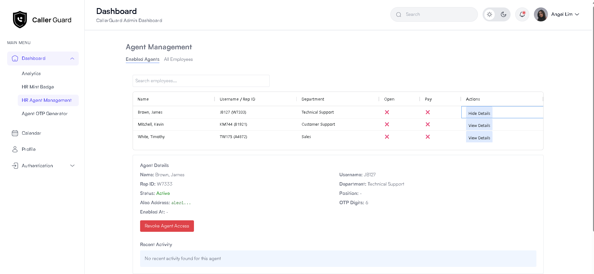

# ZK Caller Verification System (Next.js Frontend)

> **Note:** This is the **second iteration** of the ZK Caller Verification System. The original version (Python/Streamlit) can be found here: [DolphinZKP/caller-guard](https://github.com/DolphinZKP/caller-guard). It was created before deadline extension.

A secure identity verification system for call centers using zero-knowledge proofs on the blockchain. This Next.js frontend provides a robust, modern admin dashboard for managing agent identities, badge minting, and real-time verification, all while maintaining privacy and leveraging Aleo blockchain technology.

## Workflow Overview

- **HR specialists** mint blockchain identity badges for call center agents. This process writes records to the Aleo blockchain, ensuring zero-trust and eliminating the risk of internal fraud or tampering.
- **Call agents** can then generate time-based one-time passwords (OTPs) using the app.
- When an agent attempts verification, the app retrieves a zkProof (proof JSON) generated at the time of OTP generation, based on the agent's rep_id, bank number, and one-time code.
- The system uses these zkProofs for secure, privacy-preserving verification during calls.

## UI Screenshots

Below are screenshots of the main UI screens:

### Main Dashboard (Analytics)


### HR Mint Badge


### HR Agent Management



### Agent OTP Generator


### Backend Design


## Key Features

- **Next.js 14 Frontend:** Modern, responsive admin dashboard UI (built on nextjs-admin and aleohq sdk for TypeScript)
- **Aleo Blockchain Integration:** Secure agent identity verification using zero-knowledge proofs
- **One-time Verification Codes:** Unique, time-limited codes for secure caller authentication
- **HR Management Portal:** Streamlined interface for managing agent verification and permissions
- **Real-time Verification:** Instant verification of agent identity during calls
- **Privacy-Preserving:** Zero-knowledge proofs ensure sensitive data remains private
- **Role-based Access:** HR/Admin and Agent dashboards
- **Beautiful UI:** Built with Tailwind CSS and React

## Aleo SDK, Leo, and Backend Integration

- **Aleo SDK & Leo:**
  - The Aleo program source is in `aleo/agent_manager/src/main.leo`.
  - The frontend interacts with the Aleo blockchain via the Aleo JS SDK (see `/src/app/hr-admin/worker.ts`).
  - The `aleohq` SDK was downloaded to execute and interact with Leo scripts, but custom Python wrappers were created for more direct and efficient control of the Leo CLI.
  - Python manages the database, API endpoints, and orchestrates blockchain operations.
  - During badge minting/revoking, HR writes records to the Aleo blockchain for immutable, zero-trust record keeping, eliminating potential internal fraud or tampering.
  - zkProofs are generated at OTP creation time using snarkVM, via the Python wrapper for Leo CLI. These proofs are then used for agent verification.
  - The backend is designed for extensibility: future analytics and language model features can be added directly to the Python backend to help call centers with agent workflows, script generation, and upsell opportunities.

## Project Structure

```
/src
  /app
    /hr-admin         # HR admin dashboard and badge minting
    /agent-dashboard  # Agent dashboard for OTP generation
    /agent-management # Agent management and permissions
    /auth             # Authentication (sign-in, etc.)
    /profile          # User profile and settings
    ...
  /components         # Reusable UI components
  /assets             # Logos and images
  /services           # API and blockchain service logic
  /context            # React context for global state
  /utils              # Utility functions
/public
  /images             # Static images (user avatars, logos, etc.)
aleo/
  /agent_manager      # Aleo program source (Leo)
```

## Quick Start

### 1. Install dependencies

```sh
npm install
# or
yarn install
```

### 2. Run the Next.js frontend

```sh
npm run dev
# or
yarn dev
```

The app will be available at [http://localhost:3000](http://localhost:3000).

## Application Tabs

- **HR Admin:** Enable call center employees as verified agents by minting blockchain identity badges
- **Agent Dashboard:** View agent details and generate one-time verification codes
- **Agent Management:** Manage existing agent accounts and permissions
- **Profile/Settings:** Edit user info and upload profile photo

## Development

- All frontend code is in `/src`
- Aleo/Leo code is in `/aleo`
- Static assets are in `/public/images`

**Note:** This is the Next.js app for the ZK Caller Verification System. The backend, database (sqlite), API (fastapi) and blockchain logic are managed separately (see `/aleo` for Leo/Aleo code).

## License

MIT
